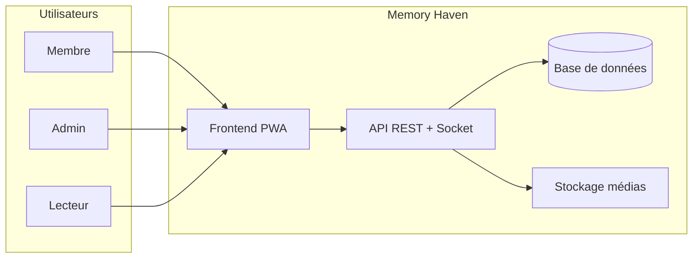
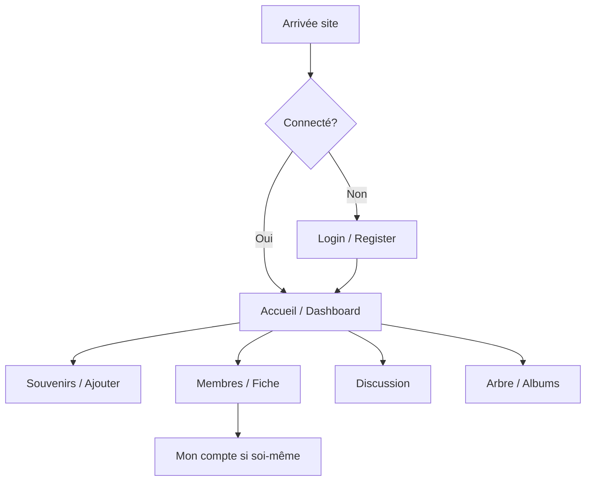
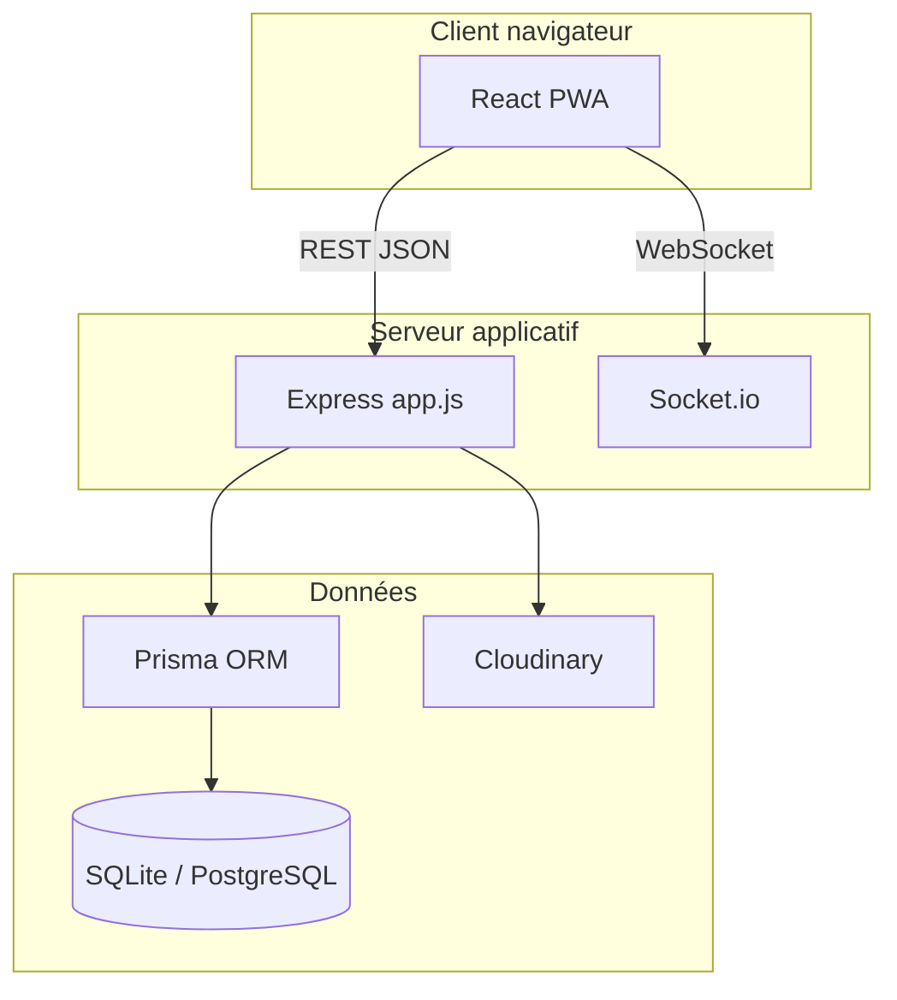

# CAHIER DES CHARGES LOGICIEL

## Memory Haven (MémoireFamille)

---

| **Document** | Cahier des charges — version logiciel |
|--------------|----------------------------------------|
| **Projet** | Memory Haven |
| **Type** | Application web progressive (PWA) — plateforme familiale privée |
| **Version du document** | 1.0 |
| **Date** | 2 juin 2026 |
| **Statut** | Validé pour référence projet |
| **Référence modèle** | Structure type *cahier des charges logiciel* (sections 1 à 6 + annexes) |

---

## Historique des révisions

| Version | Date | Auteur | Modifications |
|---------|------|--------|---------------|
| 1.0 | 02/06/2026 | Équipe projet | Rédaction initiale alignée sur l’état du produit et le dépôt `memory-haven` |

---

## Sommaire

1. [Introduction et contexte](#1-introduction-et-contexte)  
2. [Présentation du projet](#2-présentation-du-projet)  
3. [Objectifs du projet](#3-objectifs-du-projet)  
4. [Périmètre du projet](#4-périmètre-du-projet)  
5. [Acteurs et parties prenantes](#5-acteurs-et-parties-prenantes)  
6. [Spécifications fonctionnelles](#6-spécifications-fonctionnelles)  
7. [Spécifications techniques et contraintes](#7-spécifications-techniques-et-contraintes)  
8. [Besoins non fonctionnels](#8-besoins-non-fonctionnels)  
9. [Architecture et déploiement](#9-architecture-et-déploiement)  
10. [Livrables](#10-livrables)  
11. [Planning prévisionnel](#11-planning-prévisionnel)  
12. [Critères d’acceptation et recette](#12-critères-dacceptation-et-recette)  
13. [Risques et hypothèses](#13-risques-et-hypothèses)  
14. [Glossaire](#14-glossaire)  
15. [Annexes](#15-annexes)

---

## 1. Introduction et contexte

### 1.1 Objet du document

Le présent cahier des charges décrit les besoins, le périmètre, les spécifications fonctionnelles et techniques, ainsi que les critères de validation du projet **Memory Haven**. Il constitue la référence contractuelle et technique entre la maîtrise d’ouvrage (MOA) et la maîtrise d’œuvre (MOE) pour la conception, le développement, le déploiement et la maintenance de la solution.

### 1.2 Contexte

Les familles dispersées géographiquement ou générationnellement peinent à centraliser photos, récits, documents et traditions dans un espace **privé**, **sécurisé** et **accessible** aux proches autorisés. Les réseaux sociaux grand public ne garantissent ni la confidentialité ni une organisation adaptée à la mémoire familiale (arbre généalogique, hommages, chronologie, livre de famille).

**Memory Haven** répond à ce besoin par une plateforme web dédiée : chaque **famille** dispose d’un espace cloisonné, invitable par code, avec des rôles (administrateur, membre, lecteur) et des modules de publication, d’exploration et de communication.

### 1.3 Problématique

| Problème | Impact |
|----------|--------|
| Souvenirs éparpillés (téléphones, messageries, clouds personnels) | Perte d’histoire et de liens entre générations |
| Absence d’outil familial unifié | Duplication, oublis, difficulté de recherche |
| Partage non maîtrisé sur réseaux publics | Atteinte à la vie privée |
| Peu de structuration (dates, lieux, personnes) | Difficulté à construire une chronologie ou un arbre |

### 1.4 Références

- Dépôt source : `timdiguesabala-png/memory-haven` (branche `main`)
- Documentation d’exploitation : `README.md`, `UTILISER-MAINTENANT.md`, `GUIDE-LOCAL.md`
- Déploiement : `VERCEL-REDEPLOY.md`, `METTRE-A-JOUR-RAILWAY.md`

---

## 2. Présentation du projet

### 2.1 Nom et positionnement

- **Nom commercial** : Memory Haven  
- **Nom technique / alternatif** : MémoireFamille  
- **Slogan** : Plateforme familiale de souvenirs  
- **URL production (frontend)** : https://memory-haven-frontend.vercel.app  
- **URL production (API)** : https://memory-haven-api-production.up.railway.app  

### 2.2 Description synthétique

Memory Haven est une **application web responsive** (PWA) permettant à une famille de :

- Publier et consulter des **souvenirs** (photo, texte, audio, vidéo, documents)
- Organiser des **albums**, une **chronologie**, une **carte** des lieux
- Gérer un **arbre généalogique** interactif et des **fiches membres** détaillées
- Échanger via une **discussion** familiale (texte, images, messages vocaux)
- Conserver **héritage numérique**, **hommages**, **capsules temporelles** et **livres familiaux** exportables

### 2.3 Public cible

- Familles souhaitant un coffre-fort numérique privé  
- Administrateurs familiaux (création espace, invitations, modération légère)  
- Membres actifs (publication, commentaires, réactions)  
- Lecteurs (consultation seule)  
- Utilisateurs peu à l’aise avec le numérique (mode confort, interface claire)

---

## 3. Objectifs du projet

### 3.1 Objectifs stratégiques

| ID | Objectif | Indicateur de succès |
|----|----------|----------------------|
| O1 | Centraliser la mémoire familiale | ≥ 80 % des membres actifs publient ou consultent au moins 1 souvenir / mois |
| O2 | Garantir la confidentialité | 100 % des données scoped par `famille_id` ; accès authentifié |
| O3 | Faciliter l’invitation de proches | Inscription en &lt; 3 min via code + lien HTTPS |
| O4 | Assurer la pérennité | Sauvegardes BDD + médias hébergés (Cloudinary ou stockage configuré) |
| O5 | Offrir une expérience mobile | PWA installable ; navigation utilisable sur smartphone |

### 3.2 Objectifs SMART (version 1.0 livrée)

- **Spécifique** : Livrer une V1 web complète (modules listés section 6) pour une famille pilote.  
- **Mesurable** : 15 modules fonctionnels opérationnels ; health API `membresFicheDetail: true`.  
- **Atteignable** : Stack React + Node.js + Prisma déjà implémentée.  
- **Réaliste** : Déploiement Vercel + Railway (ou Render en alternative).  
- **Temporel** : Maintenance continue ; jalons documentés section 11.

---

## 4. Périmètre du projet

### 4.1 Inclus (périmètre fonctionnel V1)

| Domaine | Fonctionnalités incluses |
|---------|---------------------------|
| Authentification | Inscription famille, connexion JWT, invitation par code, 2FA (TOTP), session persistante |
| Souvenirs | CRUD, types multimédias, tags, visibilité, réactions, commentaires imbriqués, favoris |
| Albums | Albums manuels / automatiques, couverture, association souvenirs |
| Arbre | Visualisation React Flow, membres arbre, unions, lien compte utilisateur |
| Membres | Liste, rôles, invitation, fiche profil complète, désactivation |
| Discussion | Fil familial, photos, audio, réactions, accusés de lecture, temps réel (socket) |
| Exploration | Recherche, carte, timeline, statistiques |
| Mémoire avancée | Héritage, hommage, capsules temporelles, livre familial (export) |
| Compte | Profil riche (parcours, réseaux, bac, filiation), avatar, thème, mode confort |
| Notifications | Cloche, types multiples, préférences |
| Plateforme | Accueil premium, journal d’activité, suggestions IA basiques (tags) |
| Technique | API REST, WebSocket, upload Cloudinary, PWA, mode local (SQLite) |

### 4.2 Exclus (hors périmètre V1)

| Exclusion | Justification |
|-----------|---------------|
| Application mobile native iOS/Android | PWA suffit pour V1 |
| Réseau social public / découverte entre familles | Principe de cloisonnement strict |
| Paiement / abonnement | Hors scope produit familial gratuit |
| Traduction multilingue complète | Interface principalement FR |
| Modération IA avancée du contenu | Hors budget V1 |
| Intégration ERP / CRM entreprise | Non pertinent |
| Hébergement média 100 % on-premise sans cloud | Option future |

### 4.3 Hypothèses

- Les utilisateurs disposent d’un navigateur récent (Chrome, Firefox, Safari, Edge).  
- Une connexion Internet est requise en production (mode hors-ligne limité).  
- L’API de production est déployée et à jour (Railway ou équivalent).  
- Cloudinary (ou provider configuré) est disponible pour les uploads médias.

---

## 5. Acteurs et parties prenantes

### 5.1 Acteurs utilisateurs

| Acteur | Description | Droits principaux |
|--------|-------------|-------------------|
| **Super administrateur** | Créateur / gestionnaire maximal de la famille | Tous droits + gestion rôles |
| **Administrateur** | Gestion quotidienne de l’espace | Invitations, rôles, modération |
| **Membre** | Utilisateur standard | CRUD souvenirs (selon visibilité), discussion, profil |
| **Lecteur** | Consultation seule | Lecture fil, albums, fiches (pas de publication) |
| **Visiteur non connecté** | — | Accès login / register uniquement |

### 5.2 Parties prenantes projet

| Rôle | Responsabilités |
|------|-----------------|
| Maître d’ouvrage (MOA) | Vision produit, validation fonctionnelle, recette |
| Maître d’œuvre (MOE) | Développement, déploiement, documentation |
| Utilisateurs pilotes | Tests terrain, retours UX |
| Hébergeurs (Vercel, Railway) | Disponibilité infrastructure |

### 5.3 Diagramme de contexte (niveau 0)

---

## 6. Spécifications fonctionnelles

Les besoins sont identifiés par **ID** (BFxxx = besoin fonctionnel). Priorité : **M** = Must, **S** = Should, **C** = Could.

### 6.1 Authentification et accès (BF-AUTH)

| ID | Besoin | Priorité | Critères d’acceptation |
|----|--------|----------|----------------------|
| BF-AUTH-01 | Créer une famille (nom + compte admin) | M | Famille créée avec `code_invitation` unique |
| BF-AUTH-02 | Se connecter (email + mot de passe) | M | JWT émis ; redirection accueil |
| BF-AUTH-03 | Rejoindre une famille via code / lien | M | URL `/login?code=XXX` préremplit l’inscription |
| BF-AUTH-04 | Activer la 2FA TOTP | S | QR code ; validation à la connexion |
| BF-AUTH-05 | Se déconnecter | M | Token supprimé côté client |
| BF-AUTH-06 | Rafraîchir le profil session (`/auth/me` ou équivalent) | M | Avatar et rôle à jour dans l’UI |

**Cas d’utilisation UC-AUTH-01 — Connexion**

1. L’utilisateur ouvre la page de connexion.  
2. Il saisit email et mot de passe.  
3. Le système valide et retourne un token.  
4. L’utilisateur accède au tableau de bord.  
*Extensions* : 2FA requise → saisie code à 6 chiffres.

---

### 6.2 Souvenirs et fil social (BF-SOUV)

| ID | Besoin | Priorité | Critères d’acceptation |
|----|--------|----------|----------------------|
| BF-SOUV-01 | Publier un souvenir (titre, date, type, média) | M | Visible dans le fil famille |
| BF-SOUV-02 | Modifier / supprimer son souvenir (ou admin) | M | Soft delete ou masquage `is_visible` |
| BF-SOUV-03 | Commenter et répondre en fil | M | Thread parent/enfant |
| BF-SOUV-04 | Réagir (émoticônes / types définis) | M | Une réaction par utilisateur et souvenir |
| BF-SOUV-05 | Ajouter aux favoris | S | Liste favoris personnelle |
| BF-SOUV-06 | Associer tags et lieu (GPS optionnel) | S | Recherche par tag/lieu possible |
| BF-SOUV-07 | Définir la visibilité (famille / restreinte) | M | Respect du scope `famille_id` |
| BF-SOUV-08 | Épingler un souvenir | C | Affichage prioritaire fil |

---

### 6.3 Albums (BF-ALB)

| ID | Besoin | Priorité | Critères d’acceptation |
|----|--------|----------|----------------------|
| BF-ALB-01 | Créer un album manuel | M | Couverture + liste souvenirs |
| BF-ALB-02 | Albums automatiques (année, membre arbre) | S | Génération selon règles métier |
| BF-ALB-03 | Album privé | S | Visible uniquement créateur / rôles autorisés |

---

### 6.4 Arbre généalogique (BF-ARB)

| ID | Besoin | Priorité | Critères d’acceptation |
|----|--------|----------|----------------------|
| BF-ARB-01 | Visualiser l’arbre en graphe interactif | M | Zoom, pan, nœuds lisibles |
| BF-ARB-02 | Ajouter / modifier un membre arbre | M | Types ENFANT, CONJOINT, ASCENDANT |
| BF-ARB-03 | Lier un membre arbre à un compte utilisateur | S | Filiation affichée sur fiche membre |
| BF-ARB-04 | Gérer unions et enfants (modèle avancé) | S | Tables `UnionFamiliale` si activées |
| BF-ARB-05 | Sauvegarder positions du graphe | S | JSON `arbre_positions` par famille |

---

### 6.5 Membres et fiches (BF-MEM)

| ID | Besoin | Priorité | Critères d’acceptation |
|----|--------|----------|----------------------|
| BF-MEM-01 | Lister les membres actifs de la famille | M | Rôles, avatar, email affichés |
| BF-MEM-02 | Inviter par email + lien public HTTPS | M | Lien `memory-haven-frontend.vercel.app/login?code=…` |
| BF-MEM-03 | Changer le rôle / désactiver un membre (admin) | M | `is_active = false` |
| BF-MEM-04 | Afficher fiche membre complète (page dédiée) | M | Sections : identité, lieux, famille, parcours, réseaux |
| BF-MEM-05 | Modifier son profil (Mon compte) | M | PUT `/api/membres/me` persiste tous les champs profil |
| BF-MEM-06 | Consulter fiche d’un autre membre | M | GET `/api/membres/:id` ou fallback profil plateforme |

---

### 6.6 Discussion familiale (BF-DISC)

| ID | Besoin | Priorité | Critères d’acceptation |
|----|--------|----------|----------------------|
| BF-DISC-01 | Envoyer message texte | M | Fil ordonné chronologique |
| BF-DISC-02 | Envoyer photo / message vocal | S | URLs médias stockées |
| BF-DISC-03 | Réagir aux messages | S | JSON réactions |
| BF-DISC-04 | Notifications temps réel (socket) | S | Nouveau message sans rechargement |
| BF-DISC-05 | Accusés de lecture | C | `DiscussionReadState` |

---

### 6.7 Modules mémoire (BF-MEM+)

| ID | Module | Besoin | Priorité |
|----|--------|--------|----------|
| BF-HER | Héritage | Publier recettes, traditions, médias patrimoniaux | S |
| BF-HOM | Hommage | Messages sur membre arbre décédé | S |
| BF-CAP | Capsules | Message verrouillé jusqu’à `date_ouverture` | S |
| BF-LIV | Livre | Générer snapshot exportable (PDF) | S |
| BF-TIM | Timeline | Vue chronologique des événements / souvenirs | M |
| BF-CAR | Carte | Carte des lieux de souvenirs / naissances | S |
| BF-REC | Recherche | Recherche full-text souvenirs / tags | M |
| BF-STA | Statistiques | Tableaux de bord activité famille | C |

---

### 6.8 Notifications et compte (BF-NOT / BF-CPT)

| ID | Besoin | Priorité |
|----|--------|----------|
| BF-NOT-01 | Recevoir notifications (commentaire, invitation, etc.) | M |
| BF-NOT-02 | Marquer comme lues | M |
| BF-CPT-01 | Changer photo de profil (upload Cloudinary) | M |
| BF-CPT-02 | Thème clair / sombre + mode confort | S |
| BF-CPT-03 | Préférences notifications par type | C |

---

### 6.9 Parcours utilisateur principaux

---

## 7. Spécifications techniques et contraintes

### 7.1 Stack technique imposée (état actuel)

| Couche | Technologie | Version indicative |
|--------|-------------|------------------|
| Frontend | React, Vite, React Router | React 19, Vite 8 |
| UI | CSS modules / fichiers dédiés, PWA | Service worker, manifest |
| Backend | Node.js, Express | Node 20 LTS |
| ORM | Prisma | Client généré |
| BDD dev | SQLite (`dev.db`) | Fichier local |
| BDD prod | PostgreSQL (Railway/Render) ou SQLite selon env | Via `DATABASE_URL` |
| Temps réel | Socket.io | Discussion, notifications |
| Médias | Cloudinary (+ `/uploads` local dev) | Variables `CLOUDINARY_*` |
| Auth | JWT + bcrypt + TOTP | Secret `JWT_SECRET` |

### 7.2 Contraintes d’intégration

- API base : `/api/*`  
- CORS : origines `localhost:5173`, `memory-haven-frontend.vercel.app`, domaines `*.vercel.app`  
- Frontend prod : variables `VITE_API_URL`, `VITE_SOCKET_URL` injectées au build Vercel  

### 7.3 Contraintes réglementaires

- **RGPD** : données personnelles (email, téléphone, dates de naissance) — droit d’accès, rectification, suppression sur demande (procédure MOA à documenter).  
- **Mineurs** : inscription sous responsabilité de l’administrateur familial.  
- **Cookies** : token session en `localStorage` ; pas de tracking publicitaire tiers dans V1.

### 7.4 Contraintes projet

| Contrainte | Valeur |
|------------|--------|
| Langue interface | Français |
| Navigateurs supportés | Dernières versions Chrome, Firefox, Safari, Edge |
| Hébergement frontend | Vercel (gratuit / quota) |
| Hébergement API | Railway ou Render |
| Licence code | Privé — dépôt GitHub projet porteur |

---

## 8. Besoins non fonctionnels

### 8.1 Performance

| ID | Exigence | Cible |
|----|----------|-------|
| BNF-PERF-01 | Temps de chargement page accueil (4G) | &lt; 4 s (first contentful paint) |
| BNF-PERF-02 | Réponse API liste souvenirs (50 items) | &lt; 800 ms (hors upload) |
| BNF-PERF-03 | Upload photo 5 Mo | &lt; 15 s sur connexion moyenne |

### 8.2 Sécurité

| ID | Exigence |
|----|----------|
| BNF-SEC-01 | Mots de passe hashés (bcrypt) |
| BNF-SEC-02 | JWT signé, expiration configurée |
| BNF-SEC-03 | Isolation stricte par `famille_id` sur toutes les requêtes |
| BNF-SEC-04 | URLs avatar validées (domaines autorisés) |
| BNF-SEC-05 | HTTPS obligatoire en production |

### 8.3 Disponibilité et maintenance

| ID | Exigence | Cible |
|----|----------|-------|
| BNF-DISP-01 | Health check API `/api/health` | 200 + JSON version/features |
| BNF-DISP-02 | Disponibilité mensuelle cible | 99 % (hors maintenance annoncée) |
| BNF-MAIN-01 | Migrations Prisma documentées | `db push` / `migrate deploy` |

### 8.4 Ergonomie et accessibilité

| ID | Exigence |
|----|----------|
| BNF-UX-01 | Interface responsive mobile / tablette / desktop |
| BNF-UX-02 | Mode confort (polices / contrastes adaptés) |
| BNF-UX-03 | Navigation latérale regroupée par zones (Accueil, Mémoire, Explorer, Famille) |
| BNF-A11Y-01 | Contraste suffisant thèmes clair/sombre (objectif WCAG AA progressif) |

### 8.5 Évolutivité

- Architecture modulaire : routes Express par domaine (`souvenirs`, `membres`, `platform`, etc.).  
- Versionnement API via champ `version` et `features` dans `/api/health`.  
- Build frontend versionné (`APP_BUILD`) pour invalidation cache PWA.

---

## 9. Architecture et déploiement

### 9.1 Architecture logique

### 9.2 Modèle de données (entités principales)

| Entité | Rôle |
|--------|------|
| `Famille` | Tenant ; code invitation |
| `Utilisateur` | Compte membre ; profil étendu ; rôle |
| `Souvenir` | Publication centrale |
| `Album`, `Commentaire`, `Reaction`, `Tag` | Organisation et social |
| `MembreArbre`, `UnionFamiliale` | Généalogie |
| `MessageDiscussion` | Chat famille |
| `HeritageItem`, `HommageMessage`, `CapsuleTemporelle`, `LivreFamilial` | Modules mémoire |
| `Notification`, `JournalActivite` | Suivi |

*(Schéma détaillé : `backend/prisma/schema.prisma`)*

### 9.3 Environnements

| Environnement | Frontend | API | BDD |
|---------------|----------|-----|-----|
| Développement | localhost:5173 | localhost:3000 | SQLite `dev.db` |
| Production | Vercel | Railway | PostgreSQL / SQLite selon config |
| Démo | — | — | Seed `marie@demo.local` / `demo1234` |

### 9.4 Procédure de mise en production

1. Push `main` sur GitHub  
2. Vercel : build `frontend` → `frontend/dist`  
3. Railway : Docker / Nixpacks → `prisma db push` + `node src/app.js`  
4. Vérifier `/api/health` (`membresFicheDetail`, `platformPremium`)  
5. Utilisateurs : `?mh_force=1` si cache PWA obsolète  

---

## 10. Livrables

| # | Livrable | Format | Responsable |
|---|----------|--------|-------------|
| L1 | Code source frontend et backend | GitHub | MOE |
| L2 | Base de données (schéma + migrations) | Prisma | MOE |
| L3 | Application déployée (URLs prod) | HTTPS | MOE |
| L4 | Documentation installation | `README.md`, `GUIDE-LOCAL.md` | MOE |
| L5 | Documentation exploitation | `UTILISER-MAINTENANT.md`, guides déploiement | MOE |
| L6 | Cahier des charges (présent document) | Markdown / PDF | MOA/MOE |
| L7 | Jeu de données de démonstration | Script seed Prisma | MOE |
| L8 | Procès-verbal de recette | Document signé MOA | MOA |

---

## 11. Planning prévisionnel

### 11.1 Jalons (état juin 2026)

| Jalon | Description | Statut |
|-------|-------------|--------|
| J0 | Cadrage et CdC | ✅ CdC v1.0 |
| J1 | MVP auth + souvenirs + membres | ✅ Réalisé |
| J2 | Albums, arbre, notifications | ✅ Réalisé |
| J3 | Discussion, plateforme premium | ✅ Réalisé |
| J4 | Fiches membres complètes + PWA | ✅ Réalisé (v218+) |
| J5 | Stabilisation prod (Vercel + Railway) | 🔄 En cours |
| J6 | Recette MOA et V1 officielle | ⏳ À planifier |

### 11.2 Phases ultérieures (V2 — hors engagement V1)

- Export complet des données famille (RGPD)  
- Notifications email / push  
- Albums collaboratifs temps réel  
- API publique documentée (OpenAPI)  

---

## 12. Critères d’acceptation et recette

### 12.1 Critères généraux de recette

La V1 est **acceptée** si :

1. Tous les besoins **Must (M)** des sections 6.1 à 6.8 sont validés sans bug bloquant.  
2. Le parcours **inscription → publication souvenir → consultation par un autre membre** fonctionne en production.  
3. La fiche membre affiche **toutes les sections** sur `/membre/:id`.  
4. `/api/health` retourne `database: OK` et `membresFicheDetail: true`.  
5. Aucune fuite de données entre deux familles test (tests manuels avec 2 codes différents).

### 12.2 Plan de tests (extrait)

| Cas | Étapes | Résultat attendu |
|-----|--------|------------------|
| T-01 | Login démo | Accès dashboard |
| T-02 | Créer souvenir photo | Visible fil + album si ajouté |
| T-03 | Inviter membre (admin) | Lien copiable HTTPS |
| T-04 | Ouvrir fiche autre membre | Page complète scrollable |
| T-05 | Message discussion | Réception temps réel |
| T-06 | Mode sombre | Persistance préférence |

### 12.3 Responsabilité recette

- **MOE** : tests techniques, non-régression, déploiement.  
- **MOA** : tests métier, validation UX, signature PV.  

---

## 13. Risques et hypothèses

| Risque | Probabilité | Impact | Mitigation |
|--------|-------------|--------|------------|
| API Railway non redeployée | Élevée | Fiches partielles | Guides `METTRE-A-JOUR-RAILWAY.md` ; health check |
| Cache PWA obsolète | Moyenne | UI ancienne | `APP_BUILD`, `?mh_force=1`, bouton mise à jour |
| Quota Vercel / Cloudinary | Faible | Uploads bloqués | Monitoring ; upgrade plan |
| Perte BDD prod | Faible | Critique | Backups Railway ; export périodique |
| Dépendance OneDrive sync (dev Windows) | Moyenne | Fichiers verrouillés | Cloner hors OneDrive pour dev |

---

## 14. Glossaire

| Terme | Définition |
|-------|------------|
| **Famille** | Espace locataire isolé ; unité de partage des données |
| **Souvenir** | Publication (photo, texte, audio, vidéo, document) datée |
| **Code invitation** | Chaîne unique permettant de rejoindre une famille |
| **PWA** | Progressive Web App — site installable sur mobile |
| **JWT** | JSON Web Token — jeton d’authentification API |
| **MOA / MOE** | Maîtrise d’ouvrage / maîtrise d’œuvre |
| **CdC** | Cahier des charges |
| **Tenant** | Synonyme technique de famille (multi-tenant logique) |

---

## 15. Annexes

### Annexe A — Arborescence des routes frontend

| Route | Page | Accès |
|-------|------|-------|
| `/login`, `/register` | Authentification | Public |
| `/accueil` | Tableau de bord | Privé |
| `/dashboard` | Fil de souvenirs | Privé |
| `/discussion` | Discussion | Privé |
| `/heritage`, `/hommage`, `/timeline`, `/capsules`, `/livre` | Modules mémoire | Privé |
| `/albums`, `/arbre`, `/carte`, `/recherche` | Exploration | Privé |
| `/membres`, `/membre/:id` | Membres et fiche | Privé |
| `/compte` | Mon compte | Privé |
| `/ajouter` | Nouveau souvenir | Privé |
| `/statistiques` | Statistiques | Privé |

### Annexe B — Principales routes API

| Préfixe | Domaine |
|---------|---------|
| `/api/auth` | Authentification |
| `/api/souvenirs` | Souvenirs |
| `/api/membres` | Membres et profil |
| `/api/albums` | Albums |
| `/api/arbre` | Arbre généalogique |
| `/api/discussion` | Messages |
| `/api/notifications` | Notifications |
| `/api/platform` | Accueil premium, profil étendu, IA légère |
| `/api/health` | Santé et version |

### Annexe C — Matrice rôles / fonctionnalités

| Fonctionnalité | Lecteur | Membre | Admin | Super admin |
|----------------|---------|--------|-------|-------------|
| Lire souvenirs | ✅ | ✅ | ✅ | ✅ |
| Publier souvenir | ❌ | ✅ | ✅ | ✅ |
| Inviter membre | ❌ | ❌ | ✅ | ✅ |
| Changer rôles | ❌ | ❌ | ✅ | ✅ |
| Désactiver membre | ❌ | ❌ | ✅ | ✅ |
| Modifier arbre | ❌ | ✅* | ✅ | ✅ |
| Discussion | ❌ | ✅ | ✅ | ✅ |

\* Selon politique famille ; par défaut membre actif.

### Annexe D — Variables d’environnement (résumé)

**Backend** : `DATABASE_URL`, `JWT_SECRET`, `FRONTEND_URL`, `CLOUDINARY_*`, `PORT`  

**Frontend** : `VITE_API_URL`, `VITE_SOCKET_URL`, `VITE_CLOUDINARY_*`  

### Annexe E — Références documentaires projet

- `README.md` — installation  
- `UTILISER-MAINTENANT.md` — utilisation prod  
- `GUIDE-LOCAL.md` — développement local  
- `VERCEL-REDEPLOY.md` — déploiement frontend  
- `METTRE-A-JOUR-RAILWAY.md` — déploiement API  

---

**Fin du cahier des charges — Memory Haven v1.0**

*Document généré pour le projet Memory Haven. Pour export PDF : ouvrir ce fichier dans VS Code / Cursor et utiliser « Exporter en PDF » ou un outil Pandoc.*
